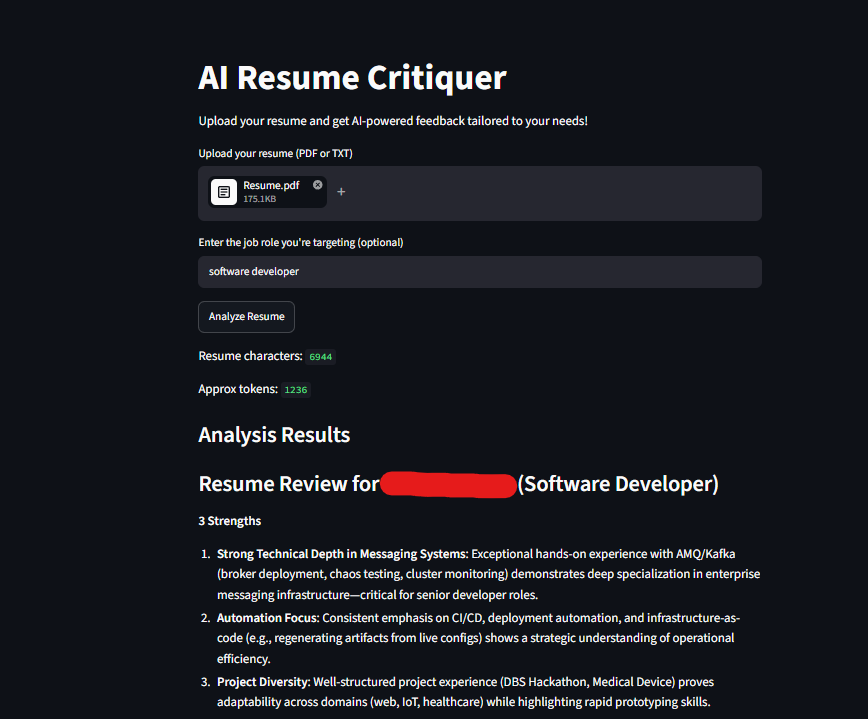
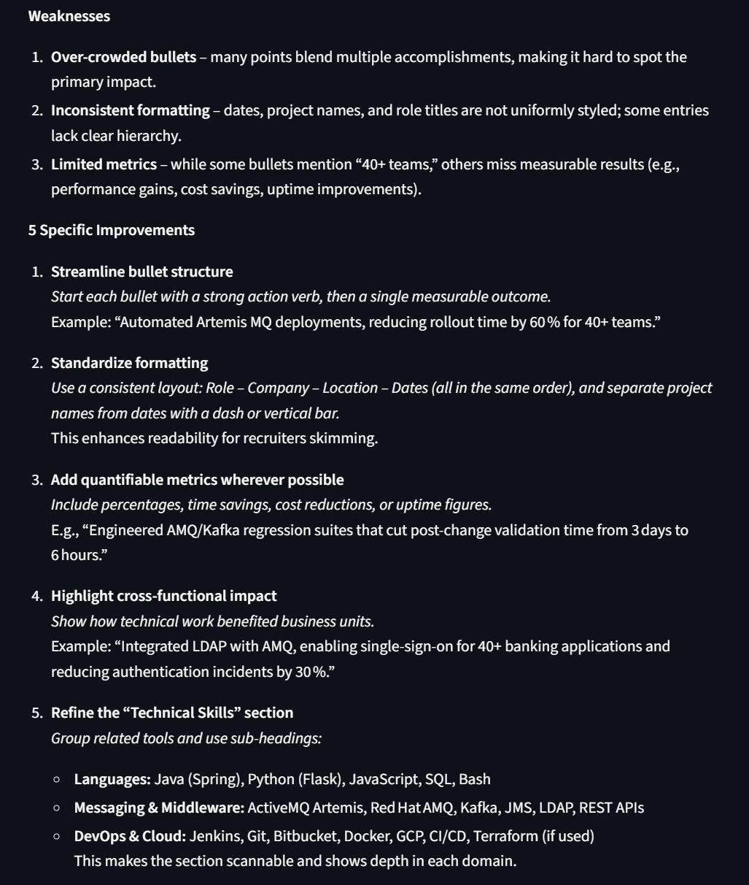
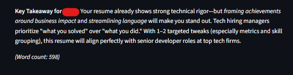

# AI Resume Critiquer
Just a little project to help with my job hunt :D


An AI-powered resume analysis application built with Python, Streamlit, LangChain, and Ollama. The application accepts PDF or text resumes and provides actionable feedback tailored to a target job role using a locally hosted LLM.

## Features
- Upload resumes in PDF or TXT format
- Extract text from PDF documents
- AI-powered resume analysis
- Tailor feedback to a specific job role
- Runs entirely locally using Ollama

## Tech Stack
- Python
- Streamlit
- LangChain
- Ollama
- PyPDF2


## INSTALLATION
### Clone repository

```bash
git clone https://github.com/bchoongwj/AI-Resume-Critiquer.git
cd AI-Resume-Critiquer
```

### Install dependencies

```bash
uv sync
```

### Download the LLM

```bash
ollama pull qwen3:4b
```

### Run the application

```bash
uv run streamlit run main.py
```

## Screenshots





## Future Improvements

- Resume ATS scoring
- Job description matching
- Support for DOCX resumes
- Streaming AI responses
- Multiple LLM model selection
